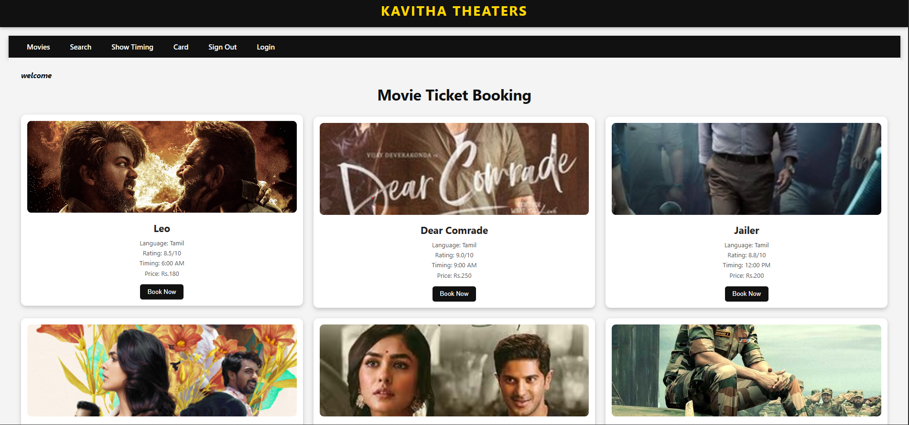

# 🎬 Kavitha Theaters - Movie Ticket Booking

## 📖 About the Project

Kavitha Theaters is a React-based Movie Ticket Booking website that provides a modern and user-friendly interface for browsing movies, viewing show timings, and navigating through different pages. This project focuses on frontend design and user experience.

---

## ✨ Features

- 🎥 Browse Movies
- 🔍 Search Movies
- 🕒 View Show Timings
- 🎫 Book Now Interface
- 🔐 Login & Sign Out Pages
- 💳 Card Page
- 📱 Responsive Design
- ⚛️ Built with React Components

---

## 📸 Screenshot

<p align="center">
  
</p>


<p align="center">
  
</p>

<p align="center">
  <b>A Responsive Movie Ticket Booking Website built with React.</b>
</p>

---
---

## 🛠️ Technologies Used

- ⚛️ React.js
- 🎨 CSS3
- 🌐 HTML5
- 💻 JavaScript

---

## 📂 Project Structure

```text
Movie-Ticket-Booking/
│── public/
│── src/
│── package.json
│── package-lock.json
│── README.md
│── Scrren.png
```

---

## 🚀 Getting Started

### Clone the Repository

```bash
git clone https://github.com/your-username/movie-ticket-booking.git
```

### Navigate to the Project Folder

```bash
cd movie-ticket-booking
```

### Install Dependencies

```bash
npm install
```

### Run the Application

```bash
npm start
```

The application will run on:

```
http://localhost:3000
```

---

## 👨‍💻 Developed By

**Sowmiya Murugan**

🎓 B.E Computer Science Engineering  
🏫 Karpagam Institute of Technology

💻 Aspiring Full Stack Developer | 📊 Future Data Analyst

---

<p align="center">
⭐ If you like this project, don't forget to Star the repository! ⭐
</p>
